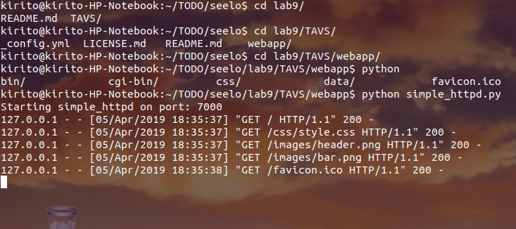
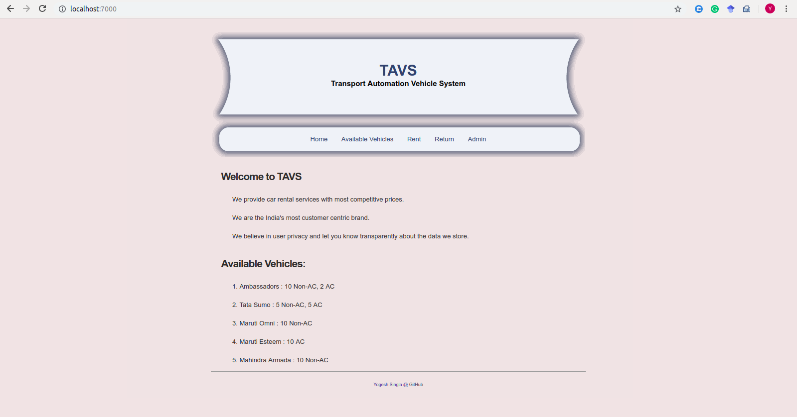

# Transport Automation Vehicle System

## About

> **Python-CGI-WebApp** is used with **Python 3** scripts for the **Transport Automation Vehicle System**.

> A **CGI** _(Common Gateway Interface)_ enabled **HTTP server** (written in Python 3) handles these requests.

## CGI (Common Gateway Interface)

### Crux of CGI
In the HTTP server, whenever a file in a certain directory is requested that file is not sent back; instead it is executed as a program, and whatever that program outputs is sent back for your browser to display. This function is called the Common Gateway Interface or CGI and the programs are called CGI scripts. These CGI programs can be a Python Script, PERL Script, Shell Script, C or C++ program, etc.


The _Common Gateway Interface_ offers a standard protocol for web servers to execute programs that execute like Console applications running on a server that generates web pages dynamically.


## Working
The webapp framework is in HTML5 and CSS while the server processing occurs in python scripts.
Both are interfaced using CGI.


## Prerequisites and Deployment

This WebApp requires Python3.  
Get Python3 from here

> https://www.python.org/

### 1. Running the WebApp

Go to directory `webapp/`

```
$ cd webapp
```

Start the HTTP Server with following command

```
$ python3 simple_httpd.py
```

You should see the following output on terminal



This means the server is ready to take requests

_DON'T CLOSE THIS TERMINAL_

2. Open your web browser and type localhost:7000

You should see the following output on terminal



3. In case of public endpoint, the available domain can be used to access this website on the internet.

### 2. Shutting down the web server

> To stop the web server simply close the terminal or press [Ctrl + C] in the terminal


